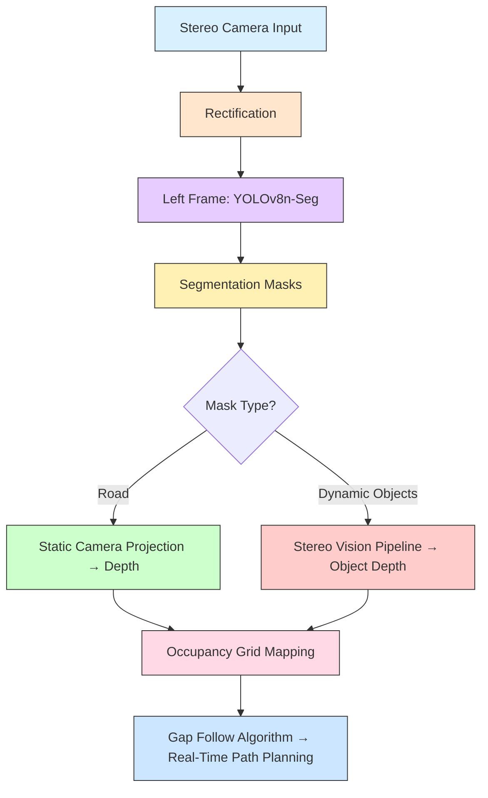

# 🚙 Automama – AGV Software Stack

This repository contains the software stack for **Project Automama (AGV)**.  
It integrates custom perception, stereo vision, and autonomous navigation pipelines with low-level actuation through an **ESP32 microcontroller**.

---

## 🧩 System Overview

- **Camera Perception** – Stereo image capture, depth estimation, and segmentation for obstacle detection.
- **Stereo Vision Pipeline** – Custom disparity → depth → 3D point cloud reconstruction, accelerated with GPU and visualized in real time with VisPy.
- **Navigation Stack (ROS2)** – Localization, costmaps, and path planning modules for autonomous driving.
- **Control & Actuation** – ROS2 communicates with **ESP32** to control:
  - Steering  
  - Throttle  
  - Braking  
- **Manual Override** – Python-Arduino bridge for teleoperation and debugging.

---

## 📂 Project Automama – Directory Structure

```text
automama
├── arduino codes/                # Arduino control scripts
│   ├── Automama_control_test_DualCore/
│   │   └── *.ino                 # Thruster, steering, brake, comms control
│   └── py_control.py             # Python-side Arduino control interface
│
├── automama/
│   ├── callab_data/              # Camera calibration files (stereo + intrinsic)
│   ├── control/                  # Manual + autonomous control scripts
│   ├── interface/                # Data logging and interface scripts
│   ├── navigation/               # Costmaps, GPS tests, VO modules
│   ├── perception/               # Stereo vision, depth estimation, segmentation
│   └── test/                     # Unit tests for communication & control
│
├── daddyutils/                   # Utility modules (camera handling, GPU, SLAM utils)
├── launch/                       # ROS2 launch files for stereo pipeline & nodes
├── resource/                     # ROS2 resource files
├── test/                         # Code quality & style tests
│
├── output_video.mp4              # Sample output (stereo pipeline demo)
├── stereo.rviz                   # RViz config for visualization
├── sust_campus_map.html          # Campus map visualization
│
├── setup.py                      # Package setup
├── setup.cfg
├── pyproject.toml
└── package.xml                   # ROS2 package manifest
```

---
## ⚙️ Technology Stack

- **ROS2 (Foxy/Humble)** – Middleware for modular control and communication  
- **Python + OpenCV** – Image processing & stereo disparity  
- **VisPy (GPU)** – Real-time 3D point cloud visualization  
- **ESP32 + Arduino** – Low-level actuation (steering, brake, throttle)  
- **RViz2** – Simulation & visualization  

---

## 🚀 Features

- Custom stereo vision → depth → 3D point cloud pipeline  
- Autonomous navigation with ROS2 planners & costmaps  
- Real-time actuation via ESP32 bridge  
- Simulation + real-world testing support  
- Modular design for future extensions  

---
## 🧠 Perception & Navigation Pipeline

In this module, we designed a **GPU-accelerated stereo vision + semantic perception stack** optimized for real-time operation on the Jetson Orin Nano.

### Workflow

1. **Stereo Camera Input** → Capture and rectify left/right frames.  
2. **Semantic Segmentation** → Apply YOLOv8n-Seg on the left frame to extract class-wise segmentation masks.  
3. **Depth Estimation**  
   - **Road Mask** → Use static camera projection for depth estimation.  
   - **Dynamic Objects** → Apply custom stereo disparity + 3D reconstruction for object depth.  
4. **Occupancy Grid Mapping** → Fuse road and object depth into a unified grid map.  
5. **Path Planning** → Run **Gap Follow Algorithm** for real-time dynamic path planning.  

### Optimization

- Entire pipeline runs on **GPU** for real-time performance.  
- Integrated with **NVIDIA VPI**, **CUDA**, and **CuPy** to handle:  
  - GPU memory context management  
  - Custom CUDA kernel insertions  
  - Concurrent processing of segmentation + stereo vision  
- Achieved **real-time inference + planning** on **Jetson Orin Nano**.



